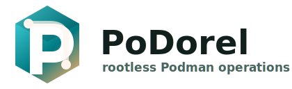
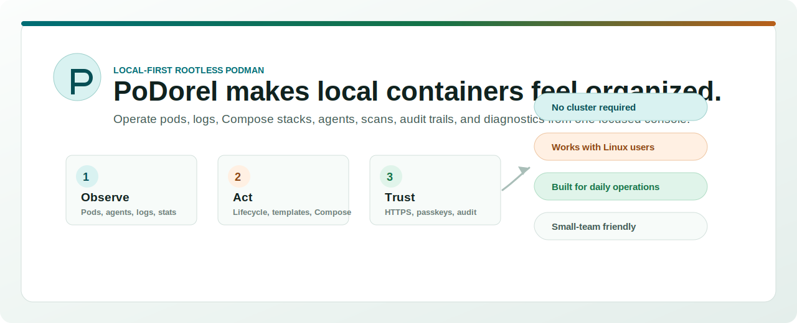

  

# PoDorel Product Presentation

> The calm control room for rootless Podman.

PoDorel gives a Linux user a focused local web console for running and
understanding rootless Podman pods. It is for people who want clear operations,
repeatable templates, security visibility, and diagnostics without adopting a
full cluster platform.

## The Problem

Rootless Podman is powerful, but everyday operations are scattered across shell
commands, logs, systemd user services, Compose folders, scanner output, and
one-off notes.

| Pain | What it feels like |
| --- | --- |
| State is fragmented | Pods, containers, logs, stats, scans, and agents are checked in different places. |
| Safety is easy to miss | Uncapped memory, unlimited scaling, missing scans, and shell access become invisible risks. |
| Debugging is slow | Useful context is spread across commands, service logs, and runtime state. |
| Kubernetes is too much | Small hosts and internal tools often need clarity, not a whole platform. |

## The Product

PoDorel turns a local Podman host into an understandable operations surface.

| Area | What PoDorel gives you |
| --- | --- |
| Operate | Start, stop, restart, inspect, and delete pods and containers. |
| Observe | Dashboard metrics, logs, resource usage, agent health, and runtime diagnostics. |
| Create | Pod templates, Compose stack deployment, Dockerfile builds, and secrets metadata. |
| Secure | HTTPS-ready config, passkeys, CSRF protection, scanner status, image digest checks, and audit logs. |
| Troubleshoot | Correlation IDs, health layers, support bundles, and clearer operational errors. |

## Why It Attracts People

PoDorel is not trying to replace Kubernetes. It gives rootless Podman the
human-facing console it deserves.

- **Less fear:** operators can see what is running and what needs attention.
- **Less drift:** templates and Compose stacks make local services repeatable.
- **Less risk:** memory visibility, scale warnings, passkeys, HTTPS, and audit
  events are surfaced instead of hidden.
- **Less guessing:** agent health, diagnostics, and logs are close to the
  actions that need them.

## How It Works

| Piece | Role |
| --- | --- |
| Browser UI | The operational console for pods, logs, templates, security, agents, settings, and diagnostics. |
| Go web/API service | Handles auth, settings, audit, SQLite state, health checks, and UI delivery. |
| Per-user host agent | Talks to the correct rootless Podman socket or CLI for a Linux user. |
| SQLite | Keeps local state simple and inspectable. |
| Native HTTPS support | Keeps browser security features like passkeys available on local installs. |

## Who It Is For

| Audience | Why they care |
| --- | --- |
| Home labs | Run useful local services without losing track of them. |
| Dev hosts | Give developers a clean view of local service stacks and logs. |
| Small teams | Operate internal tools with auditability and safer defaults. |
| Edge boxes | Keep local services visible where a full cluster is too much. |

## The Promise

PoDorel makes local container operations feel intentional, visible, and safe.

The full browser-oriented HTML deck also lives at
[`docs/podorel-presentation.html`](podorel-presentation.html). GitHub shows HTML
files as source, so this Markdown version is the GitHub-friendly presentation.
